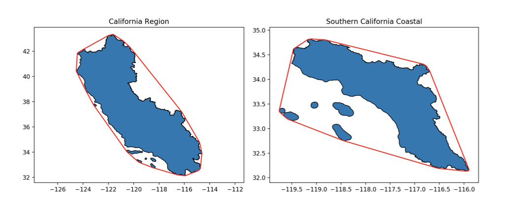
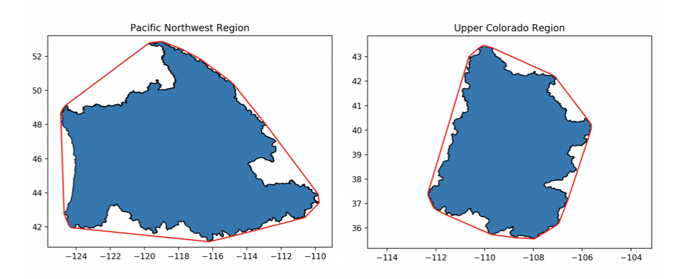
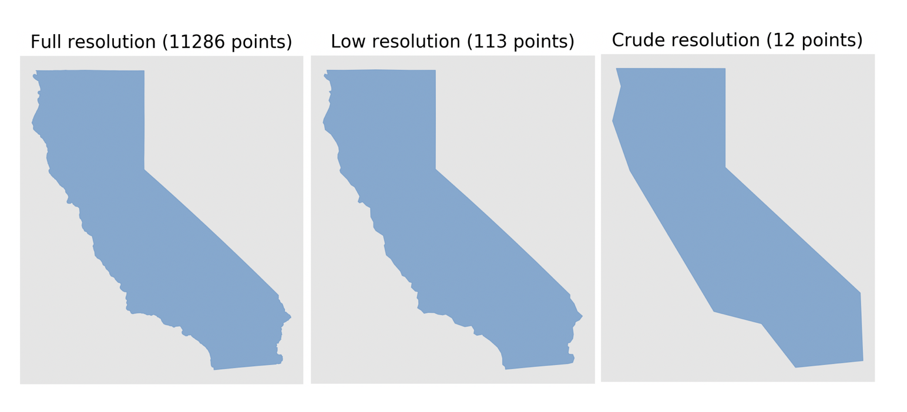
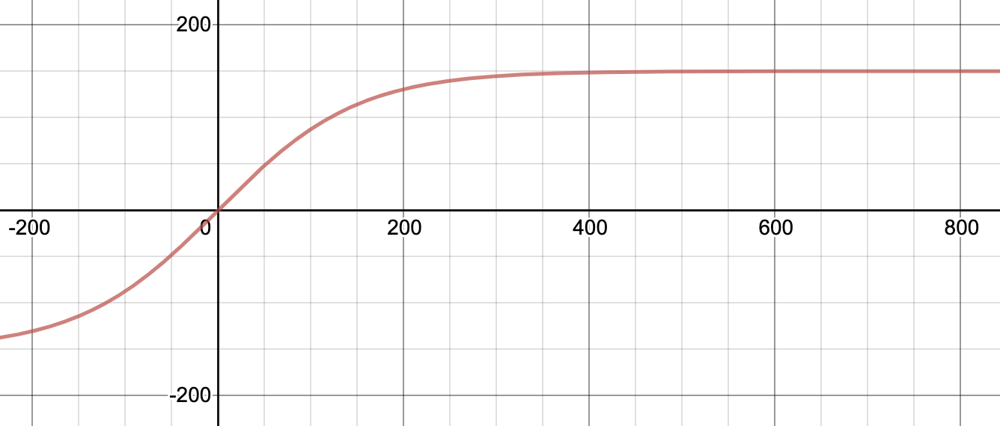
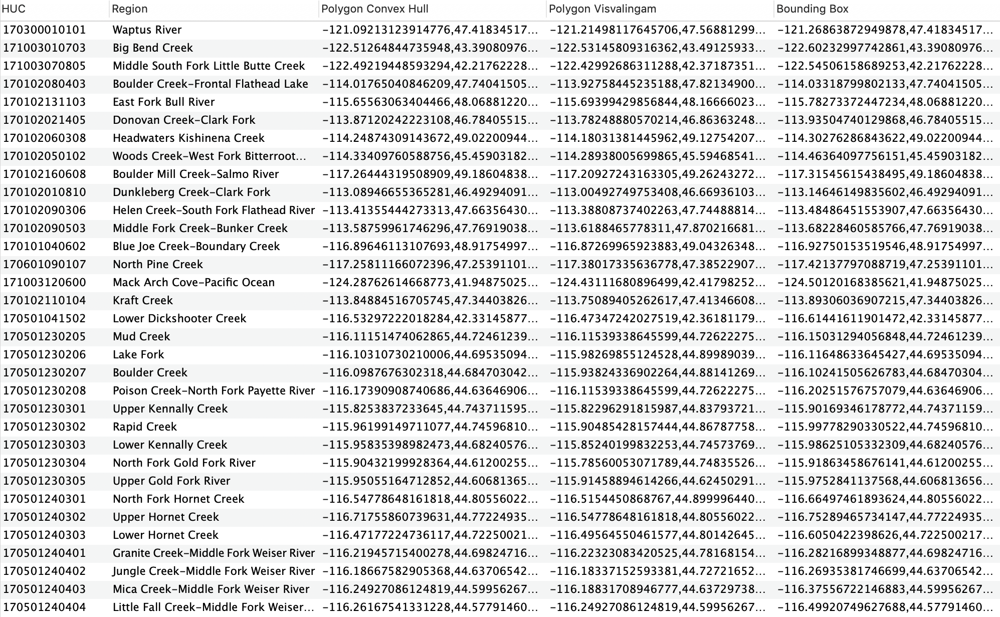

# Code Explained

This section will purely be dedicated to me explaining some of the code that I've written that might need more clarification than just a comment in the code. It will primarily center around [Pandas](https://pandas.pydata.org/) code found within the _simplify_HUC.py_ file, however I'll briefly touch on other functions where it may not be exactly clear what's going on.

***
***

Within _create\_HUC_dataset.py_:

```python
HUC_list = []
for root, dirs, files in os.walk(in_dir):
    for file in files:
        if file.endswith(".shp") and file.startswith("WBDHU"):
            HUC_list.append(os.path.join(root, file))

if len(HUC_list) == 0:
    print("No shapefiles found. Make sure you have a directory of HUC subfolders in place.")
    exit()

# Create local directory at 'output directory' location if it doesn't already
# exist
if not os.path.exists(out_dir):
    os.makedirs(out_dir)

```

Given some input directory provided, this will extract a list of _all_ paths to HUC shapefiles downloaded using _download\_data.py_ in the in [Downloading the Data](../../getting_started/downloading.md) section above. These paths can then be used to combine _all_ shapefiles into one common database.

***
***

Within _simplify\_HUC.py_:

```python
def write_to_shapefiles(multi_geometry, HUC, shapefile_location):
    '''Write all unsimplified geometries to shapefile with name as HUC'''

    try:
        # Convert to GeoSeries to be able to convert geometry to shapefile
        geometry = gpd.GeoSeries(multi_geometry)
        os.mkdir(shapefile_location + HUC)  # Make a directory with name = HUC
        geometry.to_file(shapefile_location + '{}/{}.shp'.format(HUC, HUC))
    except FileExistsError as err:
        print(err)
        time.sleep(0.1) # Race condition may occur with Pandas apply
        geometry = gpd.GeoSeries(multi_geometry)
        geometry.to_file(shapefile_location + '{}/{}.shp'.format(HUC, HUC))
```

The code above creates shapefiles of each entry in the USGS Watershed Boundary Dataset and stores them in their own folder with the _HUC_ as the name of the folder. This try/except block is required as I'd on occasion obtain a FileExistsError when writing to the folder. I chalked this up to a race condition as Pandas parallelizes writing to directories, as that really shouldn't have been an error. The except block does catch the error with a slight sleep() command.

***
***

Within _simplify\_HUC.py_:

```python
def simplify(multi_geometry, single_geometry, length, max_vertices):
    '''Function that takes in a polygon and returns a simplified version taking
    the convex hull of the region.'''

    # Convert to GeoPandas Series and perform convex hull operation
    polygons = gpd.GeoSeries(multi_geometry)
    polygons_hull = polygons.convex_hull.item()

    # Format into CMR queryable polygon
    complex_hull_CMR_poly = format_polygon(polygons_hull)

    #######################

    # Map the reduction of vertices to a tanh function
    reduction = int(max_vertices * np.tanh((1/max_vertices) * length))

    # Initial simplification
    points = list(single_geometry.exterior.coords)
    simplifier = vw.Simplifier(points)

    visval_poly_points = simplifier.simplify(number = reduction)
    visval_poly = Polygon(visval_poly_points)
    visval_CMR_poly = format_polygon(visval_poly)

    ######################

    bbox = str(polygons_hull.bounds)
    CMR_bbox = re.sub(r'[()\s+]', '', bbox)


    return complex_hull_CMR_poly, visval_CMR_poly, CMR_bbox
```

This is the code used to simplify a given geometry through two simplification techniques: the [Convex Hull](https://en.wikipedia.org/wiki/Convex_hull) approach and the [Visvalingam-Whyatt Algorithm](https://bost.ocks.org/mike/simplify/). These algorithms are essential to the Feature Translation Service because larger polygons have too many vertices to be queried through partner tools. I chose to include two simplifications algorithms for a variety of reasons, but primarily because they cater to two different applications:

The convex hull approach _**guarantees**_ no loss of information. Some examples of this can be seen below:





The Visvalingam-Whyatt Algorithm offers a more accurate simplification, however at the cost of losing information. This can be seen below:





In the code above, you can be seen that I map the Visvalingam-Whyatt reduction of points to a specific value. For example, I might simplify the California Region (originally ~12,000) vertices to 150 vertices. You may also see that that number depends on the original size of the polygon - where the input number of vertices is mapped to output number of vertices through the tanh function _output vertices = max vertices * tanh(input vertices / max vertices)_. So, as mentioned in the [Overview](overview.md) section, you'll specify that maximum number of vertices found in the equation above through the command line. Thus, given you set it equal to 150, you'll obtain values along the function:



I went back and forth about a proper function to use, but ultimately it needed to be one which more severely simplifies _larger_ polygons than smaller ones. This is because a polygon that, say, reduces from 50,000 vertices to 500 vertices (x100 decrease) will appear much less affected than a polygon that reduces from 1,000 vertices to 10 (the same x100 decrease). This problem can easily be seen with the below pictures:


So this tanh function is roughly equal to _y = x_ for small values of x (exactly what we want as this then doesn't reduce the number of vertices for small polygons) whereas is approaches _y = 150_ (where our max vertices defined as 150 before) for large polygons.

***
***

So ideally if an end user _requires_ no information loss, they'll choose the Convex Hull polygon, however if they're not too concerned, they'll choose the Visvalingam polygon. That said, we also provide access to the exact shapefile from USGS, just through our S3 bucket in AWS.

In order for the geometry to be then be used by NASA's partner tools (primarily NASA's [Common Metadata Repository](https://earthdata.nasa.gov/eosdis/science-system-description/eosdis-components/cmr) (CMR) the polygons must be formatted according to [this](https://cmr.earthdata.nasa.gov/search/site/docs/search/api.html#c-polygon) specification. I used the following code to do this:

***
***

```python
def format_polygon(polygon):
    '''Function that takes a polygon as input and returns a string formatted to
       be queryable through CMR'''

    # Re-orient polygon points to be counter-clockwise and in the correct
    # CMR format
    polygon = shapely.geometry.polygon.orient(polygon, sign=1.0)
    coords = str(list(polygon.exterior.coords))
    CMR_polygon = re.sub(r'[()[\]\s+]', '', coords)

    return CMR_polygon
```

This takes in a polygon, re-orients it to be counter-clockwise (proper format for CMR), then extracts exterior coordinates and removes all extraneous paratheses.

***
***

Finally, I used the following code to create call the simplify function, create the directory structure of shapefiles mentioned previously, and add the CMR queryable polygons and bounding box to the final local database. I then dropped the unsimplified polygon column from the database as well.

*Note:* The directory structure of shapefiles is only created locally. To update what is in the S3 bucket, you must copy the structure over.


```python
def create_resolutions_and_combine(df, out_dir, max_vertices):

    # Used to display progress bar
    tqdm.pandas()

    shapefile_location = "Shapefiles/"
    if os.path.exists(shapefile_location):
        shutil.rmtree(shapefile_location)

    os.mkdir(shapefile_location)

    print("Writing to shapefiles...")
    df.progress_apply(lambda row: write_to_shapefiles(row['Geometry'], row['HUC'], shapefile_location), axis = 1)

    df['len'] = df.apply(lambda row: len(list(row['Geometry_Without_Multipolygons'].exterior.coords)), axis = 1)

    # Iterate over all rows in dataframe and simplify
    print("Simplifying polygons...")
    df['Polygon Convex Hull'], df['Polygon Visvalingam'], df['Bounding Box'] = zip(*df.progress_apply(lambda row: simplify(row['Geometry'], row['Geometry_Without_Multipolygons'], row['len'], int(max_vertices)), axis = 1))
    df.drop(['Geometry_Without_Multipolygons', 'len'], inplace = True, axis = 1)
    df.dropna(inplace = True)

    print("Writing to file.")
    df.to_csv(out_dir + 'HUC_data.csv', index = False)
```

A "HUC_data.csv" file is created that contains the entire dataset. This is exactly what is uploaded to AWS.

This final dataset is only around 1 GB. It contains information relating the *Region, HUC, Convex Hull Polygon*, _Visvalingam-Whyatt Polygon_ and *Bounding Box* of all ~130,000 HUCs currently in the USGS Watershed Boundary Dataset.

A small subset of the database can be seen below:


