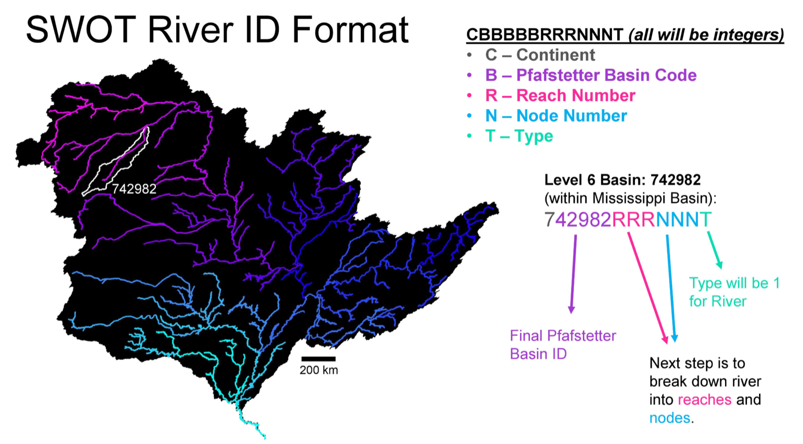
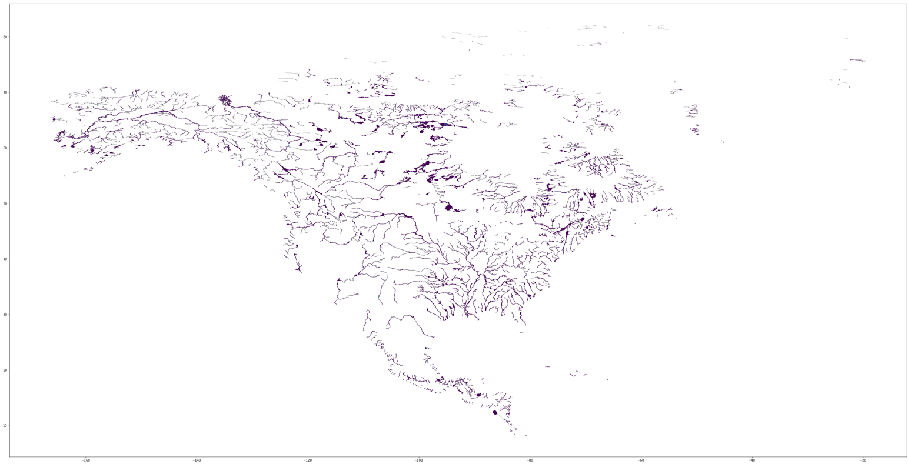

# Code Explained

This section will purely be dedicated to me explaining some of the code within the _SWOT Database Creation_ that might need more clarification than just a comment in the code. I've attempted to structure the SWOT code in a way that makes it incredibly similar to that of the HUC code. This way, you'll be able to more easily see the differing approaches taken. Creating the SWOT database will not require any simplification algorithms, as the data contained will only be linestrings and points.

In addition to this section, I've provided a Jupyter notebook that will allow you to create and visualize some of the SWOT data included in the SWORD database.

***
***

Within _parse_SWOT.py_:

```python
# Remove indices that are negative. Maybe a mistake in the SWORD database?
# Only ~600 / 10,000,000 have this negative.
df.drop(df[df['segInd'].str.startswith("-")].index, inplace=True)

# Pad each column with zeros for same length
# SegID: 1234 -> 1234
# SegID: 1 -> 0001
df['basin_code'] = df['basin_code'].apply(lambda x: str(x).zfill(6))
df['segID'] = df['segID'].apply(lambda x: str(x).zfill(4))
df['segInd'] = df['segInd'].apply(lambda x: str(x).zfill(5))

# Create SWOT Feature ID according to standard concatenation of:
# continent code + basin code + reach + node + lakeflag
df['SWOT_ID'] = df['basin_code'] + df['segID'] + df['segInd'] + df['lakeflag'].map(str)
```

The code above is used to create the SWOT Feature ID according to the following standard:



First though, there were ~600 of the ~10,000,000 points that had _negative_ segment indices. This is shown more in depth in the associated Jupyter notebook. I'm not entirely sure if this is intended behavior, as this sort of defeats the purpose of having one unified SWOT Feature ID (as concatenating a negative seems unintuitive). At this point, I'm assuming these are unintentional, and have removed them from the final database using the first line of code above.

The following three lines are used to ensure each SWOT Feature ID has the same length.

```python
# Pad each column with zeros for same length
# SegID: 1234 -> 1234
# SegID: 1 -> 0001
df['basin_code'] = df['basin_code'].apply(lambda x: str(x).zfill(6))
df['segID'] = df['segID'].apply(lambda x: str(x).zfill(4))
df['segInd'] = df['segInd'].apply(lambda x: str(x).zfill(5))
```

For example, in the following table, you can see where concatenating would cause a mismatch in lengths:

<center>

| Basin Code     | Segment ID  | Segment Index    | Lake Flag | SWOT Feature ID |
| :---:          |    :----:   |          :---:   | :----:    | :---:           |
| 799080         | 1           | 1                | 0         | 79908011        |
| 799080         | 7637        | 26872            | 0         | 799080763726872 |

</center>

In order to standardize this SWOT Feature ID, I've padded each value to the max number of digits required per column. This is similar to the picture above, however we required 4 digits for the Segment ID and 5 for the Segment Index. Thus the values in the table above would be modified to:

<center>

| Basin Code     | Segment ID  | Segment Index    | Lake Flag | SWOT Feature ID |
| :---:          |    :----:   |          :---:   | :----:    | :---:           |
| 799080         | 0001        | 00001            | 0         | 799080000100001 |
| 799080         | 7637        | 26872            | 0         | 799080763726872 |

</center>

The final line of code combines each column into the final SWOT Feature ID seen above.

***

Since no simplification was necessary, the code for the SWOT database creation was much simpler than the HUC creation code. The _create_SWOT_dataset.py_ code is relatively similar to that of the _create_HUC_dataset.py_ code, thus I'll skip going into detail about it.

***

As a final note, this is the entire _SWORD_ database plotted to give you a better idea of what you're working with:



and a subset of what is created from the _create_SWOT_dataset.py_ file can be seen below:

<center>


</center>
