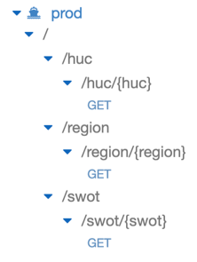

# Tutorial Overview

Migrating the SWOT database to AWS, creating the Lambda function, and creating the API Gateway was largely similar to the HUC procedure. For the most part, all that really varied was the Lambda function. Thus, if you follow the previous HUC steps, the changes detailed below should be relatively straightforward to implement if necessary.

# Similarities/Differences to HUC

Database creation is unnecessary. Given we've already created the Feature Translation Service database in the HUC portion of this tutorial, we can just add a new table, naming it _swot_table_ instead of _huc_table_. If you've created the _SWOT_Data.csv_ file in the [SWOT Database Creation](../../local_database_creation/SWOT/overview.md), you can directly upload this to the FTS database using SequelPro (as done in the HUC portion) or through another mySQL tool. Doing so in SequelPro involves:

- File &rarr; Import
- Navigate to _SWOT_Data.csv_ file created earlier.
- Ensure you're not appending this to the HUC table by clicking the drop down menu in the top *right* and selecting **New Table**.
- Set the 'SWOT_Feature ID' Target Field to a _VARCHAR(100)_ and the 'geometry' field to _TEXT_.
- Press **Import** in the bottom left.

***

As mentioned previously, the biggest change between the SWOT portion of the Feature Translation Service and the HUC portion is the Lambda function. You can find my Lambda code below:

<details><summary><span style="color:blue">Click here for my Lambda code!</span></summary>
<p>


```python
import rds_config
import logging
import pymysql
import time
import json
import re

# Set up connection variables
rds_host  = rds_config.db_endpoint
name = rds_config.db_username
password = rds_config.db_password
db_name = rds_config.db_name
port = 3306

logger = logging.getLogger()
logger.setLevel(logging.INFO)

# Connect to the mySQL database
try:
    conn = pymysql.connect(rds_host, user=name,
                           passwd=password, db=db_name, connect_timeout=5)
except:
    logger.error("ERROR: Unexpected error: Could not connect to MySql instance.")
    sys.exit()

logger.info("SUCCESS: Connection to RDS mysql instance succeeded")

###########

def format_json(cur, swot_id, exact, time):

    # Fetch all results from mySQL query
    results = cur.fetchall()

    # ********** #
    TO_JSON = False     # Modify to "True" once CMR JSON POST support is available.
    # ********** #

    data = {}

    if results[0][0] == None:
        data['error'] = "404: Results with the specified SWOT Feature ID {} were not found.".format(swot_id)
    elif len(results[0][0]) > 5750000:
        data['error'] = "413: Query exceeds 6MB with {} hits.".format(str(int(len(results[0][0].split("&")))))

    else:
        data['status'] = "200 OK"
        data['hits'] = int(len(results[0][0].split("&")))
        data['time'] = str(time) + " ms."
        data['search on'] = {"parameter": "SWOT Feature ID", "exact": exact}
        data['results'] = {}
        data['results'][swot_id] = {}


        if TO_JSON:
            results = results[0][0].split("&")
            data['results'][swot_id] = {}

            # 1 result returned
            # No need for "OR" between multiple points
            if len(results) == 1:
                geometry = results[0].split("=")
                data['results'][swot_id]['condition'] = {geometry[0]: [float(e) for e in geometry[1].split(",")]}
            else:
                data['results'][swot_id]['condition'] = {}
                data['results'][swot_id]['condition']['or'] = []


                # OR'ing together multiple points. Single line for loop creates individual
                # dictionaries with point/vertex key/value pairs. So, for example, one iteration
                # will result in:

                # {point: [94.323423, 43.230432]}

                # This is done for each point/linestring returned, and the final result is added to a
                # giant list correctly formatted for CMR JSON POST request.
                for geometry in results:
                    element = geometry.split("=")
                    data['results'][swot_id]['condition']['or'].append({element[0]: [element[1]]})

        # Since JSON POST'ing support isn't currently available, this just returns
        # a CMR queryable list of all points used in the form:

        # point=100,20&point=140,30... which can then be used like so:

        # "https://cmr.earthdata.nasa.gov/search/collections?point=100,20&point=140,30"
        else:
            data['results'][swot_id] = results[0][0]

    return data


def lambda_handler(event, context):

    with conn.cursor() as cur:

        start = time.time()

        # Necessary as I'm concatenating all query results returned. Default max
        # size is like 1024 characters, which isn't nearly enough.
        cur.execute("SET group_concat_max_len = 100000000")

        # Searching on SWOT Feature ID
        if "SWOT_ID" in event['body']:

            # User has given an 'exact' value
            if "exact" in event['body']:

                # User wants the query to be exact
                if event['body']['exact'].lower() == "true":

                    # Return everything EQUAL to the input
                    cur.execute("select GROUP_CONCAT(`geometry` SEPARATOR '&') from swot_table where `SWOT_ID` = %s", event['body']['SWOT_ID'])
                    exact = True

                # User wants partial matches (or misspelled "true")
                else:

                    # Search Feature IDs for similar results starting with user input.
                    cur.execute("select GROUP_CONCAT(`geometry` SEPARATOR '&') from swot_table where `SWOT_ID` LIKE %s", event['body']['SWOT_ID'] + "%")
                    exact = False

            # User didn't given an "exact" value in API request
            # Assume exact = False
            else:
                cur.execute("select GROUP_CONCAT(`geometry` SEPARATOR '&') from swot_table where `SWOT_ID` LIKE %s", event['body']['SWOT_ID'] + "%")
                exact = False

            end = time.time()

            return format_json(cur, event['body']['SWOT_ID'], exact, round((end - start) * 1000, 3))

        else:
            # Return 400 error assuming path is incorrect.
            data = {}
            data['error'] = "400: The specified URL is invalid (does not exist)."
            return data


```

</p>
</details>

 <br/>

You'll notice this is slightly shorter than the previous Lambda function as less formatting was necessary for the output.

In the exact same fashion as creating the HUC Lambda function, this would be zipped up and uploaded to AWS with the _pymysql_ package.

***

Creating test events is largely similar, however instead of looking like so:

```
{
  "body": {
    "exact": "True",
    "region": "Woods Creek-Skykomish River"
  }
}
```

it might look something like:

```
{
  "body": {
    "exact": "False",
    "SWOT_ID": "75411400010000"
  }
}
```

Furthermore, within the API Gateway Integration Request, we'd format a mapping template to look like so:

```
{
  "body": {
    "exact":"$input.params('exact')",
    "SWOT_ID": "$input.params('swot')"
  }
}
```

If this doesn't make sense, I'd highly recommend watching the video tutorial I've done on this [here](https://drive.google.com/open?id=1rNfWO3NuX53jynmMZaTi5JPj0FRvnNGp), or go back and reread the HUC portion of the tutorial.

***

Finally, I created a separate OpenAPI .yaml file for the SWOT Feature Translation Service found below:

<details><summary><span style="color:blue">Click to expand my OpenAPI 3.0 file:</span></summary>
<p>


```
openapi: 3.0.0
info:
  title: swot-lambda-API
  description: API used for PO.DAAC feature translation service
  version: 0.1.0
paths:
  /swot/{swot}:
    get:
      operationId: getswot
      parameters:
        - description: The SWOT Feature ID to return.
          in: path
          name: swot
          required: true
          schema:
            example: "75411400010000"
            type: string
      responses:
        '200':
          content:
            application/json:
              schema:
                $ref: '#/components/schemas/200'
        '400':
          content:
            application/json:
              schema:
                $ref: '#/components/schemas/400'
        '404':
          content:
            application/json:
              schema:
                $ref: '#/components/schemas/404'
        '413':
          content:
            application/json:
              schema:
                $ref: '#/components/schemas/413'
      summary: Returns associated name and simplified polygon
components:
  schemas:
    200:
      description: 200 response from API
      properties:
        point_list:
          description: Point list for queried region.
          example: "point=-83.62575151546879,9.252305471126416&point=-83.62575352733344,9.252576533363468"
          type: string
      required:
        - point_list
      type: object
    400:
      description: 400 response from API
      properties:
        error:
          description: "The specified URL is invalid (does not exist)."
          type: string
      required:
        - error
      type: object
    404:
      description: 404 response from API
      properties:
        error:
          description: "An entry with the specified SWOT Feature ID was not found."
          type: string
      required:
        - error
      type: object
    413:
      description: 413 response from API
      properties:
        error:
          description: "413: Your query has returned is too large."
          type: string
      required:
        - error
      type: object
```
</p>
</details>
<br/><br/>

That said, all of this was included in one API Gateway deployment stage that looks as follows:

<center>



</center>

So querying the API is identical to querying via HUC/region except instead of looking like:

```
curl https://g6zl7z2x7j.execute-api.us-west-2.amazonaws.com/prod/huc/{huc}
```

it looks like:

```
curl https://g6zl7z2x7j.execute-api.us-west-2.amazonaws.com/prod/swot/{swot_feature_id}
```
